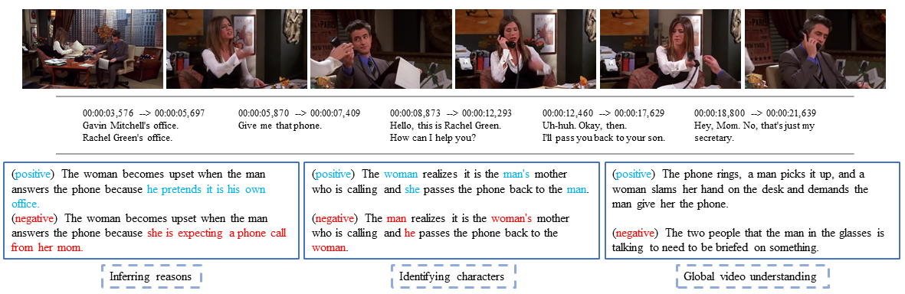
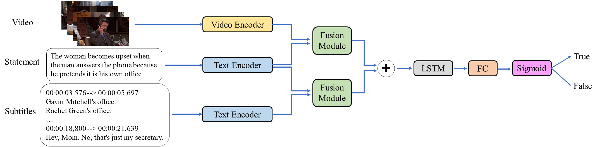

## VIOLIN: A Large-Scale Dataset for Video-and-Language Inference
Data and code for CVPR 2020 paper: "[VIOLIN: A Large-Scale Dataset for Video-and-Language Inference](https://arxiv.org/pdf/2003.11618.pdf)"

We introduce a new task, Video-and-Language Inference, for joint multimodal understanding of video and text. Given a video clip with aligned subtitles as premise, paired with a natural language hypothesis based on the video content, a model needs to infer whether the hypothesis is entailed or contradicted by the given video clip. A new large-scale dataset, named *__Violin__* (VIdeO-and-Language INference), is introduced for this task, which consists of 95,322 video-hypothesis pairs from 15,887 video clips, spanning over 582 hours of video. These video clips contain rich content with diverse temporal dynamics, event shifts, and people interactions, collected from two sources: (i) popular TV shows, and (ii) movie clips from YouTube channels. In order to address our new multimodal inference task, a model is required to possess sophisticated reasoning skills, from surface-level grounding (e.g., identifying objects and characters in the video) to in-depth commonsense reasoning (e.g., inferring causal relations of events in the video). We present a detailed analysis of the dataset and an extensive evaluation over many strong baselines, providing valuable insights on the challenges of this new task.

[comment]: # (paper link)

### Violin Dataset
- Data Statistics

source | #episodes | #clips | avg clip len | avg pos. statement len | avg neg. statement len | avg subtitle len
------ | -------- | ----- | ------------ | ---------------------- | ---------------------- | ----------------
Friends|234|2,676|32.89s|17.94|17.85|72.80
Desperate Housewives|180|3,466|32.56s|17.79|17.81|69.19
How I Met Your Mother|207|1,944|31.64s|18.08|18.06|76.78
Modern Family|210|1,917|32.04s|18.52|18.20|98.50
MovieClips|5,885|5,885|40.00s|17.79|17.81|69.20
All|6,716|15,887|35.20s|18.10|18.04|76.40

- Data will be released soon.

### Baseline Models
- Model Overview

### Usage
- Code and scripts will be released soon.

[comment]: # (### Citation)

